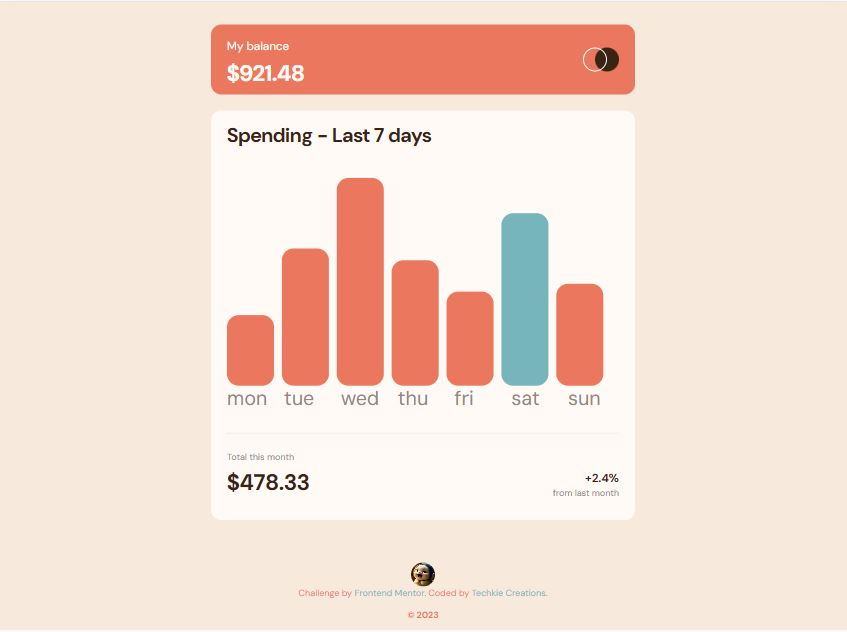

# Frontend Mentor - Expenses chart component solution

This is a solution to the [Expenses chart component challenge on Frontend Mentor](https://www.frontendmentor.io/challenges/expenses-chart-component-e7yJBUdjwt). Frontend Mentor challenges help you improve your coding skills by building realistic projects.

## Table of contents

- [Overview](#overview)
  - [The challenge](#the-challenge)
  - [Screenshot](#screenshot)
  - [Links](#links)
- [My process](#my-process)
  - [Built with](#built-with)
  - [Continued development](#continued-development)
- [Author](#author)

## Overview

### The challenge

Users should be able to:

- View the bar chart and hover over the individual bars to see the correct amounts for each day
- See the current day’s bar highlighted in a different colour to the other bars
- View the optimal layout for the content depending on their device’s screen size
- See hover states for all interactive elements on the page
- **Bonus**: Use the JSON data file provided to dynamically size the bars on the chart

### Screenshot

### Links

- Solution URL: [You are already here](https://github.com/Techkie-Creations/expenses-chart-frontendmentor)
- Live Site URL: [Expenses Chart Frontend Mentor](https://techkie-creations.github.io/expenses-chart-frontendmentor)

## My process

### Built with

- Semantic HTML5 markup
- CSS custom properties
- Flexbox
- Desktop-first workflow
- [D3js](https://d3js.org/) - JS Data Visualisation Library

### Continued development

There will be no further development maybe only the styling.
I do intend to make a full fledged financial webapp - stay tuned if interested.

## Author

#### Techkie Creations

- Frontend Mentor - [@Techkie-Creations](https://www.frontendmentor.io/profile/Techkie-Creations)
- Codepen - [@Techkie-Creations](https://codepen.io/Tech--Guy)
- LinkedIn - [@stefan-ngago](https://www.linkedin.com/in/stefan-ngago)
